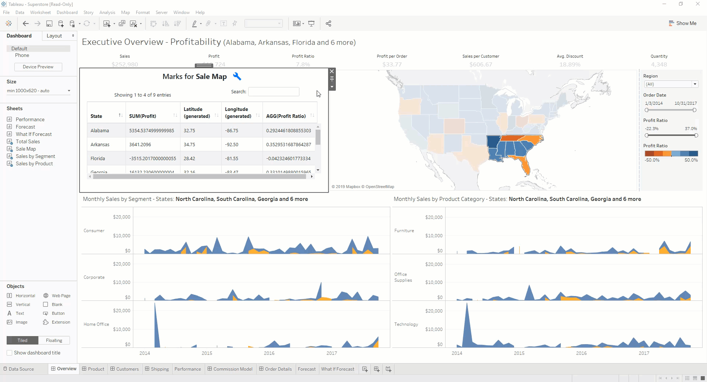

## Part 5 - Persisting Settings in the Workbook

As you may have noticed when playing with our sample up to this point, when the extension reloads or the workbook is reloaded, we lose track of which sheet the user has selected to view data for. This creates a suboptimal user experience and would be quite unusable if your extension had a lot of customization or if you wanted to publish your workbook or send it to someone and have them see what you saw. Luckily, the Extensions API includes a settings API which allows you to persist key/value pairs into a workbook to be used again when the extension is reloaded.

#### Saving Settings

To take advantage of the [settings API](https://tableau.github.io/extensions-api/docs/interfaces/settings.html), we add calls to `tableau.extensions.settings.set('sheet', worksheetName)` and `tableau.extensions.settings.saveAsync()` once the user has selected their sheet. These APIs together will persist the sheet name into the workbook for it to be available between reloads and will go with the workbook if you publish to server or send to another user.

#### Retrieving values

To retrieve these values, we add a call to `tableau.extensions.settings.get('sheet')` in our initialization code. If we have a saved sheet name, we immediately switch to the data table view instead of showing the configuration dialog.

#### Trying it out

To see our changes in action, we can either click the reload button in the zone, or save our workbook, close Tableau, and reopen it to see our extension back in the state it was.

[Next Section (Part 6 - Performing Actions)](../Part_6/readme.md)